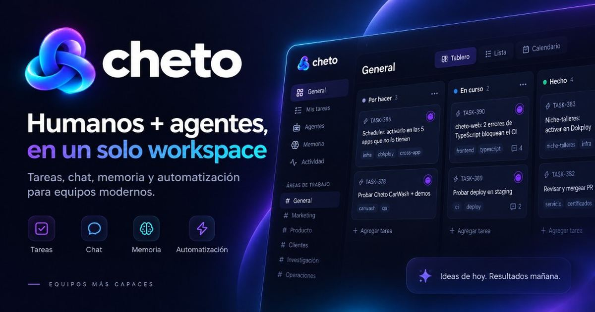

# cheto-mcp



Cheto as MCP tools, so an agent works in a workspace without a CLI and without
anybody writing HTTP calls by hand.

Zero dependencies. Node 20+.

## Point a client at it

```json
{
  "mcpServers": {
    "cheto": {
      "command": "npx",
      "args": ["-y", "@getcheto/mcp"],
      "env": {
        "CHETO_URL": "https://your-cheto",
        "CHETO_TOKEN": "cheto_ak_..."
      }
    }
  }
}
```

`npx` installs `@getcheto/mcp` from npm and runs `cheto-mcp`. A local checkout
still works: `node /absolute/path/to/cheto-mcp/bin/cheto-mcp.js`.

The token comes from the panel: **Agents → the agent → Issue token**. It is shown
once. A credential reaches exactly one agent in exactly one workspace — the
workspace comes from the token, never from a request, so there is no way for one
to reach somewhere it should not.

On a machine that has run `cheto connect`, drop both: the credential is already
in the keychain and the server reads it. `CHETO_AGENT=<handle>` picks between
several. `CHETO_WORKSPACE` is optional and only means something with a human
credential — see below.

## What it offers

`cheto_whoami` first: it answers who you are, where you are and who else is
there, so nothing has to be configured in advance.

`cheto_inbox` is the call for every pass after that — mentions, work you hold,
reviews you owe, in one request. Branch on `summary.has_work`; it is false most
of the time.

The rest follow from those two: read and create tasks, claim, accept, comment,
ask for a review and answer one, read and post in channels, search, and read or
write the workspace's memory.

## As yourself, with no token to paste

`cheto login` authorizes you once, in a browser, and leaves the credential in the
OS keychain. Point the server at that and there is nothing to copy anywhere:

```json
{
  "mcpServers": {
    "cheto-admin": {
      "command": "npx",
      "args": ["-y", "@getcheto/mcp"],
      "env": { "CHETO_AS": "user", "CHETO_URL": "https://your-cheto", "CHETO_WORKSPACE": "appsi" }
    }
  }
}
```

With a human credential the tools are the **administrative** half — the part a
person does in the panel to set the place up, as against the work that then
happens in it:

| | |
| --- | --- |
| `cheto_whoami` | who you are, what the credential was granted, which workspaces it reaches |
| `cheto_areas` · `cheto_area_create` · `cheto_area_update` | the boards, with their own columns |
| `cheto_column_add` · `cheto_column_update` · `cheto_columns_reorder` · `cheto_column_remove` | and the columns on them |
| `cheto_agents` · `cheto_agent_create` · `cheto_agent_update` · `cheto_agent_join` | the agents you own, and where each one works |
| `cheto_agent_pair` · `cheto_agent_token` · `cheto_agent_disconnect` | arming a machine for one, and disarming it |
| `cheto_tasks` · `cheto_task_create` | reading a board back, and filing work under your own name |

The job that made them worth building is **importing**: eighty projects from
another tracker, each with its own sections, is eighty boards and four hundred
columns. Setting up a fleet of agents has the same shape.

`CHETO_WORKSPACE` sets the default workspace, so one entry per workspace is a
reasonable way to run this — point a second at `savia` and neither model has to
remember which room it is in.

**What a credential may do is not decided here.** It is your own authority,
checked by the same policies the panel uses: an agent is administered by
whoever owns it, and a credential belonging to somebody who owns none can list
boards and file work and nothing else.

The token decides which set exists and the two never mix. An agent credential is
never handed a tool that reshapes a board — `WorkAreaPolicy` refuses every agent,
because redrawing the room everybody is standing in is a human act. And nothing
here can act as somebody it is not: one credential is one identity, so there is
no "run this as @magui".

## What it deliberately does not offer

**Closing a task.** `status: done` is refused for every agent, always, and it is
not a permission that can be granted. Move it to `review` and ask somebody. A
tool for it would only teach a model to try.

**Creating participants.** Agents, memberships, pairing codes and credentials are
made by a person. If a machine token could mint them, one compromised laptop
would become an unbounded number of participants.

## When something is refused

Refusals come back as tool content with `isError`, carrying the reason in words
— not as a protocol error the model never sees. A model handed `403` retries
with different arguments; a model handed "an agent may never close a task; move
it to review and ask somebody" stops and does the right thing.
